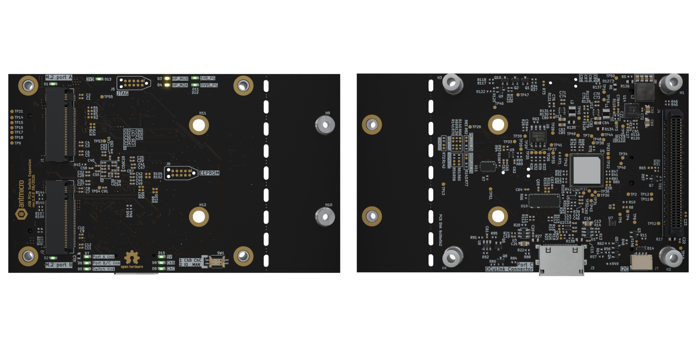

# PCIe Switch Expansion for Antmicro Baseboard for NVIDIA Jetson Orin

Copyright (c) 2026 [Antmicro](https://www.antmicro.com)

## Overview

This project contains open hardware PCB design files for an expansion board compatible with Antmicro's [Baseboard for Jetson Orin](https://github.com/antmicro/jetson-orin-baseboard).
The design includes a PCIe 3.0 switch that expands the number of available PCIe ports by connecting multiple PCIe endpoint devices to a single PCIe root complex.
The expansion board includes an OCuLink Connector and two M.2 (key-M) slots intended for connecting additional storage solutions with optional RAID support.
Both M.2 slots support 2280 and 2242 M.2 NVMe drives.
The design files were prepared in KiCad 10.x.

## Key features

* Accessory compatible with expansion connector located on Antmicro Baseboard NVIDIA Jetson Orin
* Supports for 2280 and 2242 M.2 NVMe drives
* 1x M.2 key M PCIe x2 slot 
* 1x M.2 key M or 1x OCuLink Connector PCIe x2 (multiplexed lane)
* 100 x 60 mm (3.94 x 2.36 inch) PCB outline

## Project structure 

The main directory contains KiCad PCB project files, the LICENSE, and this README, and the img directory contains graphics for this README.

## Licensing

This project is published under the [Apache-2.0](LICENSE) license.
